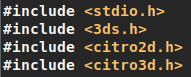
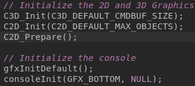
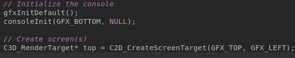
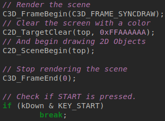
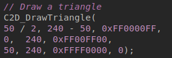
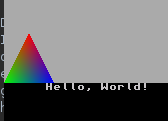
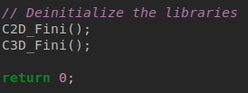
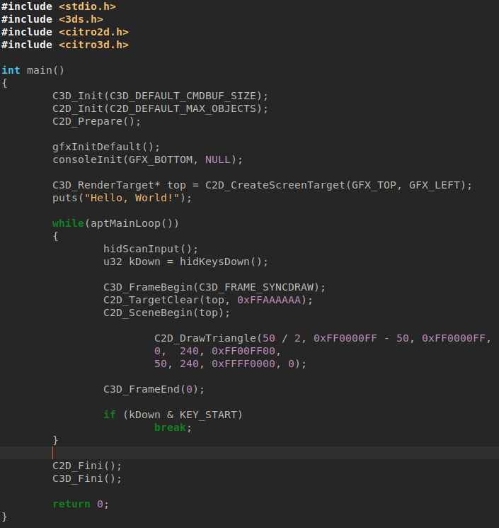

# Drawing a Triangle

We will draw shapes to the screen, learning more about how the 3DS draws its graphics. Or at least, this library.
## Includes

We will need citro2d.h and citro3d.h for this to work.

## Initialization

We need to initialize Citro2D and Citro3D in order to draw things:

## Drawing 2D shapes to the screen
### Initializing the display

To do this, we must create a render target for a screen that does NOT have a console initialized on it, as the system needs to know what to render to when drawing the shapes.

We must store a render target in a C3D_RenderTarget* pointer, and initialize it to C3D_CreateScreenTarget([SCREEN HERE], GFX_LEFT).

Replace '[SCREEN HERE]' with either GFX_TOP or GFX_BOTTOM, depending on what screen you want.

The second argument of the last one allows the use of a secondary framebuffer for stereoscopic 3D. Just leave it to GFX_LEFT:

This will give us something to render to when drawing the shapes.
### Using the display

We need to, in order, tell it to start drawing, clear the screen, draw our shapes, and then stop drawing.

Coming up will be 32-Bit ARGB Hexadecimal colors. We will use them for clearing the screen, and the shape colors.

This code does exactly that. We can put our draw code in between C2D_SceneBegin() and C3D_FrameEnd(), for example:

C2D_DrawTriangle() takes 10 arguments. The first 9 are the the three points, each with 3 arguments, X, Y, and Color. The last one is Depth.
## Deinitialization

In order to prevent problems, we should deinitialize libraries when we are done using them:

## Wrapping up

With that finished, the code should look somewhat like this:

