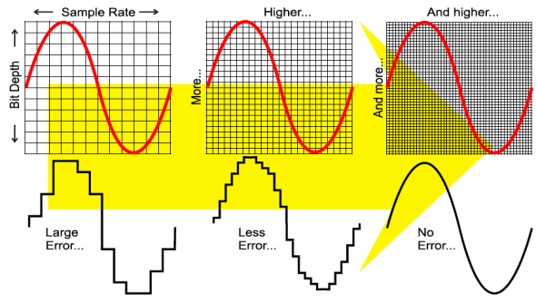
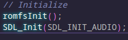
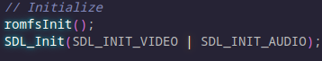
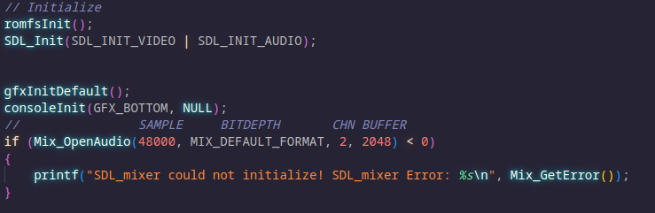
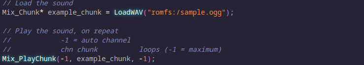
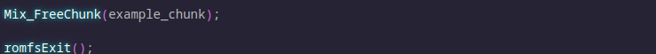
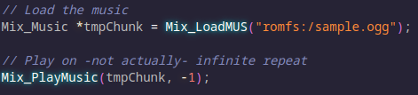
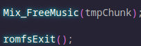

# Audio with SDL_mixer

Working with the low-level DSP and Sound APIs for the Nintendo 3DS is extremely complicated, where in SDL_mixer you can both load and stream audio of many different formats quite easily.

For this reason, I recommend using SDL_mixer for:

* New programmers
* Programmers already familiar with SDL_mixer
* If you want more readable code
* If you want it done quick
* Multi-platform projects

HOWEVER, while SDL_mixer supports stereo audio, and panning/etc, it does ***NOT*** support Spatial Audio. 

(Though you probably will never be using it for that on a 3DS anyway)
## Notice
I have found you may need ```dspfirm.cdc``` present in the emulators SD card directory for audio to work right. You can get this through modding your 3DS.

## Concepts
To understand things here, you might need some context.
### File formats
Different file formats can store sound in different ways. One example is .WAV, where, aside from some header information, sound is simply stored in the file without compression. Compare this to .OGG, where the file goes a great deal of compression, but still sounds fine.

I ***highly*** recommend using .OGG in game projects.
### Sample rates
Sample rates are how fast the individual numbers that make up the data are played, measured in Hertz. This should match the stored sample rate of the song... Unless you want some slowdown or speedup effects? Try it. 

The louder a sound is, lower quality becomes more apparent.

44100-48000 Hertz audio is quite common. Larger tends to give higher quality sounds, at a direct tradeoff of size.



### Bit depth
You may see in the above image that there is a "bit depth" along the Y-axis. Think of this as a sort of "Vertical Sample-Rate". A larger bit-depth allows more accurate numbers for every sample, increasing quality. Again at a direct tradeoff of size.

Up to 16-bit is perfectly fine for this.

### How sound is loaded
Sounds are loaded into chunks, which contain audio data.
Sound Chunks will contain the ***WHOLE*** sound effect, so use them wisely. Sounds may take time to load.

Music is loaded into a data structure, where it stores data ***ABOUT*** the music, but does not contain the music itself. This approach is known as "streaming" audio, and not only takes up much less memory, but reduces loading time to near-zero.

You can play multiple Sounds at once, but you can only play one Music track at once.

### How sound is played
Sound chunks are played in a bunch of different "Channels", each can play one. You can specify a channel, or automatically select one. 

You can specify certain effects on channels, like changing volume.

Music is played through a single master channel, and thus only one can be played.

## Getting Ready to Play Audio
Now that we have gone over some terms, we need to first make preparations.

First we need to initialize SDL's Audio subsystem. We do this by adding ```SDL_INIT_AUDIO``` to SDL_Init:



If you want to initialize more than that, you can chain them together by using the Bitwise OR operator ```|```:



We need to specify how we want the audio. This can return a value below zero, indicating that an error has occured. This example checks for that and prints it to the screen:



## Playing a Sound Sample
Time to load the audio:


And play it too, on an auto-selected channel and on repeat:



And when we are finished, we free it like so:



## Streaming Audio as Music

It's really almost the same; Just some renaming, and a lack of channels to deal with or specify:



And free it similarly as well:



That's basically all you need to start with. There are more complicated things that can be done, but for the sake of brevity, they will be in a different page.