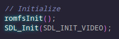

# Setting up SDL 1.2

SDL 1.2 (Not to be confused with its successor, SDL 2) is a multi-platform library for numerous things like input, graphics, audio, and more.

Keep in mind that SDL 1.2 is not only outdated, but graphics are done through the CPU, making it extremely slow compared to other ways of drawing.

There are multiple parts of the library, parts that may help with ease of use, such as the "SDL_mixer" library.
## Installing SDL 1.2 for 3DS
### Windows
Open the MSYS2 install found in the DevKitPRO install directory, and use:
``(sudo) pacman -Ss 3ds-sdl`` to ***find all*** SDL packages available for the Nintendo 3DS.

To install one, use ```(sudo) pacman -S [package name]```

### Linux
Similar to the one above, but from the terminal, use:
``(sudo) (dkp-)pacman -Ss 3ds-sdl`` to ***find all*** SDL packages available for the Nintendo 3DS.

To install one, use ```(sudo) (dkp-)pacman -S [package name]```

### A quick copy-paste
Use these to install all of them quickly, in the terminal.

Debian-based Linux:

```sudo dkp-pacman -S 3ds-sdl 3ds-sdl_mixer 3ds-sdl_ttf 3ds-sdl_ttf 3ds-sdl_gfx```

Arch Linux / MSYS2:
```sudo pacman -S 3ds-sdl 3ds-sdl_mixer 3ds-sdl_ttf 3ds-sdl_ttf 3ds-sdl_gfx```

## Linking to it in your project
If you have problems getting it to find where the libraries are, try adding ```-L$(DEVKITPRO)/portlibs/3ds/lib``` to the ***very right*** of the LIBS field in your Makefile.

If you have problems including it, try adding ```-I$(DEVKITPRO)/portlibs/3ds/include``` to the ***left*** on the ***CFLAGS +=*** field in your Makefile.

### SDL (Base library)
Add ```-lSDL``` to LIBS in your Makefile, ***to the right of any other SDL-related libraries.***

### SDL_mixer
SDL_mixer requires some other libraries to work. These ***may*** be installed automatically upon installing SDL_mixer.

Add ```-lSDL_mixer -lmikmod -lmad -lvorbisidec -logg``` ***to the left*** of your ```-lSDL -lpng -ljpeg``` in the LIBS field in your Makefile.

### SDL_image
Add ```-lSDL_image -lpng -ljpeg -lz``` ***to the left*** of your ```-lSDL``` in the LIBS field in your Makefile.

### SDL_ttf
I need to figure this one out, but it might be similar to the SDL_mixer in that it requires some other libraries.

For now, add ```-lSDL_ttf``` ***to the left*** of your ```-lSDL``` in the LIBS field in your Makefile, and add as needed.

## Testing it in an empty project

### Copy-paste:
Some code ready to copy-paste into a main.c file, just add an image in your RomFS:

```c
#include <3ds.h>
#include <SDL/SDL.h>
#include <SDL/SDL_image.h>

int main()
{
	// Initialize
	romfsInit();
	SDL_Init(SDL_INIT_VIDEO);
	SDL_Surface *screen = SDL_SetVideoMode(400, 240, 24, SDL_HWSURFACE);
    // Make sure you have an image here!
	SDL_Surface *image = IMG_Load("romfs:/image.png");

	// Hide the cursor
	SDL_ShowCursor(SDL_DISABLE);

	// Main loop
	while (aptMainLoop())
	{
		// Scan for button presses
		hidScanInput();

		// Respond to user input
		u32 kDown = hidKeysDown();
		if (kDown & KEY_START)
			break; // break in order to return to hbmenu

		// Draw to screen
		SDL_BlitSurface(image, NULL, screen, NULL);
		SDL_Flip(screen);
	}

	// Exit
    SDL_FreeSurface(screen);
    SDL_FreeSurface(image);
	romfsExit();
}
```

## Step-by-step

### Initializing
First include
```#include <3ds.h>```,
```#include <SDL/SDL.h>``` and
```#include <SDL/SDL_image.h>```
to your project.


Initialize RomFS so you can read files on your ROM, then add ```SDL_Init(SDL_INIT_VIDEO);``` to your main() function:



This will initialize the Video component of SDL. Next, we need something to render to. In SDL 1.2, we use Surfaces to render to, of type ```SDL_Surface```. Surfaces should be freed when they are done being used. To create a surface to render to, add:

```SDL_Surface* screen = SDL_SetVideoMode(400, 240, 24, SDL_HWSURFACE);```


SDL_SetVideoMode sets up a Surface to render to. 400x240 is the resolution, 24 is the bit-depth, and SDL_HWSURFACE is where to put it.
### Loading an image
We can also use Surfaces to hold textures in SDL 1.2 (DO NOT DO THIS IN SDL2, SDL2 adds GPU rendering). To load a texture into a Surface, add:

```SDL_Surface *image = IMG_Load("romfs:/image.png");```


After that, set up a main loop as normal. But at the end, we will put the texture on the screen, then show the screen (flipping the buffers):


This draw the texture to the screen. 

Now, if you run it now, you may notice a little mouse cursor stuck at the top left.


To disable this mouse cursor, put ```SDL_ShowCursor(SDL_DISABLE);``` below ```IMG_Load```:


and it should be gone.


### Deinitializing
Finally, add these two lines to the bottom to free the Surfaces, removing them from memory:

```c
SDL_FreeSurface(screen);
SDL_FreeSurface(image);
```

Also a good idea to unload RomFS as well. Now it should look like this:


And you should be done.
Be warned, SDL_INIT_EVERYTHING seems to crash for me. Might for you.
