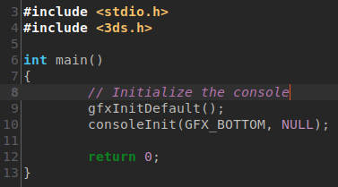
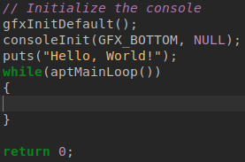
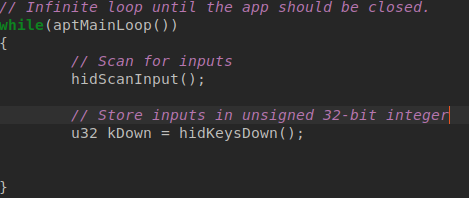
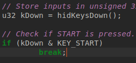
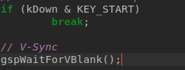
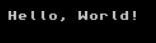

# Hello, World

'Hello, World!' is a very simple program used for checking a program's build system, and showing its basic syntax.
We should do both before going forward. You should have your project set up for this.

And if you are using VSCode, I would recommend you get the include paths set up.

A word of advice: ALWAYS comment what your code does whenever possible.
## Begin coding

Start by including 'stdio.h' (or 'cstdio'!) and '3ds.h'.
A quick explanation of '3ds.h'

'3ds.h' is the file containing references to all the VITAL things we can use to program on the system.

It does not include many features, such as (And certainly not limited to) rendering capabilities, aside from running the console)
## Main loop

Start by setting up a main function as usual for C/C++.

To initialize the graphics, we need to run gfxInitDefault().

To initialize the console, we need to run consoleInit([SCREEN HERE], NULL).

Replace '[SCREEN HERE]' with either GFX_TOP or GFX_BOTTOM, depending on what screen you want.

At this point, the code should look something like this:

As the console is now ready, you can now print to the screen. You can use puts(), printf(), std::cout, etc.

If we try and run it now, it should immediately close itself, as there is no main loop.

To create a main loop, we create a while loop with aptMainLoop() as its argument:

## Input

Okay, so we now have a main loop... How do we exit back to the Homebrew Launcher?

Simple. We can scan for input, and break if it detects a button, in this case START, being pressed.

We can scan for input with hidScanInput(), and get which keys are down with hidKeysDown() like so:

Every button is mapped to a different bit on the unsigned 32-bit integer.

We can get specific keys via an AND operation between the integer and the desired key:

## Wrapping up

We can add V-Sync with gspWaitForVBlank(), which may help if you want that and don't want to draw anything aside from the console. You can disregard this if you want:

And we are done. You can run the program, and get the words 'Hello, World!' printed on the screen:

