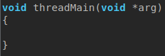
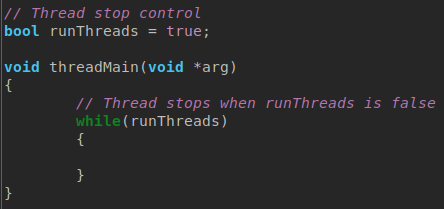
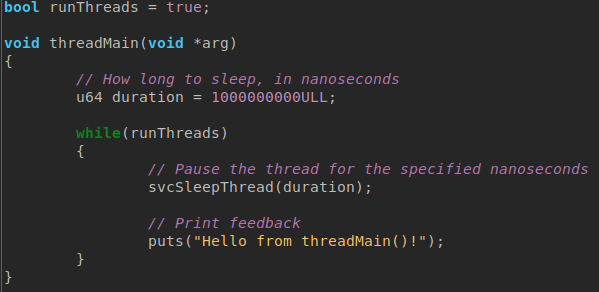
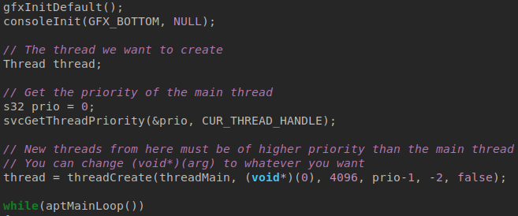
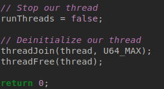
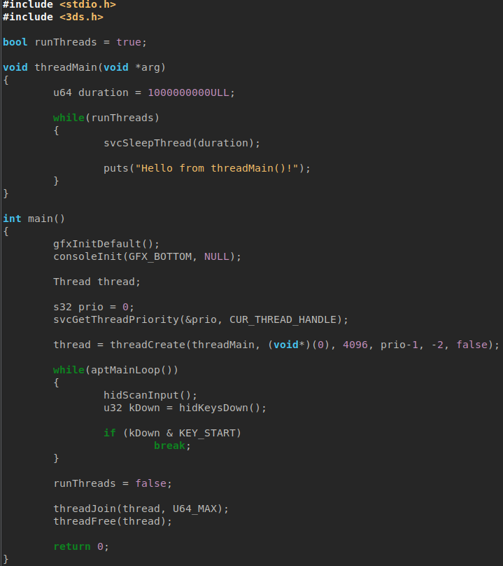

# Multithreading

Multithreading is the process of running multiple things concurrently within a single program.

With this, you can distribute the programs workload, improving performance.

An example - a program could use one thread for graphics, and one for logic. The graphical thread would not have to deal with the logic, and so on.
## Setting up a thread
### Thread function

A thread would call another function, similar to the main() function.

Create another function like this right above main():

Inside the threadMain() function, we need a loop to control when the thread stops.

### Adding a delay

Threads can be paused for a specified amount of nanoseconds with svcSleepThread(). In this case, the thread will run every one second, printing "Hello from threadMain()!":

### Using the thread

To run our thread, we must create it in main(). It must have a higher priority (lower value) than the main() thread, otherwise problems will occur.

We can also specify the size of the stack for our thread.

The thread can be created like this, first fetching the priority of main(), and creating one lower than that set to threadMain():

The thread will now run independently of the main loop, so there is nothing more to do to set it up.
## Deinitializing a thread

We must always safely delete a thread after we are done with it. Problems may happen if you do not.

First we set runThreads to false, stopping the threads safely.

Then, we deinitialize the thread:

## Wrapping up

With that finished, the code should look somewhat like this:

