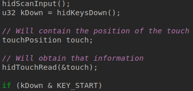
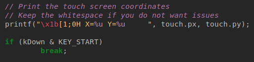
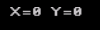
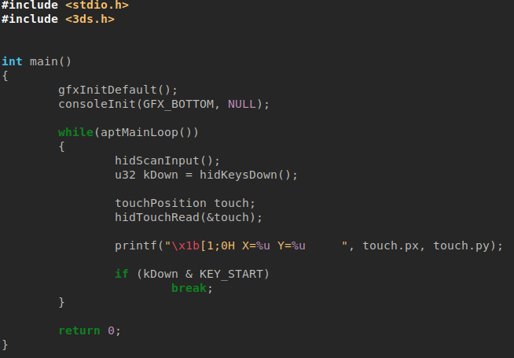

# Touchscreen Input

Here we will find the position of a touch on the touchscreen.

It is very simple to do this.
## Getting the touch position

To find the touch position, we need to request the touchPosition type from the OS, and read from that.

We must first create a touchPosition like so:

The touch position is stored in our touchPosition as 'px' and 'py'.
## Printing the information to the screen

To print the position so we may see it, we should, instead of spamming the console with it, overwrite the X and Y position output by setting the position of the output first.

This would make it much easier to read, although we would need some whitespace after it to prevent anything getting printed without overwriting:

The position should default to [0, 0] when no touch is found:

## Wrapping up

Our code should now look like this:
