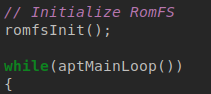
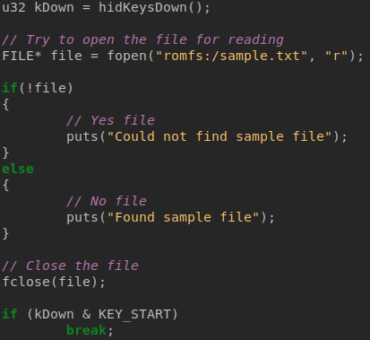

# Accessing ROM files with RomFS

RomFS allows us to access files stored on the ROM file, cartridge, or application.

It can be used to read things such as graphics assets, audio data, and other data.

## RomFS folder

You may have noticed while building that there is a folder named 'romfs' in your project:

(If it is not already present, create it now.)

This is where all the program files are stored. These files are mounted on 'romfs:/' when the app is running.

If you have any sprites, they will appear in the 'gfx' directory inside of 'romfs:/', and are accessed accordingly.

Create a text file inside of 'romfs', name it something like 'sample.txt' (or 'sample' if you have file extensions off):

This file will appear as 'romfs:/sample.txt' in the program.

## Using RomFS

We will initialize RomFS, check if a file exists, and then deinitialize.

### Initializing

Initializing RomFS is trivial - It only takes one simple function to do it:

### Using

To access a file, we do basically the exact same thing we could do on a home computer in C or C++, just with a different drive.

We will check if the file exists, first by trying to open it, and checking if it failed to open. This is what you would normally do in C:

You can play with this by adding or removing sample.txt from the 'romfs' folder.

### Deinitializing

Like initializing RomFS, it only takes another simple function to deinitialize:

And that is all you need to access files on the ROM.

## Wrapping up

Our code should now look like this:

